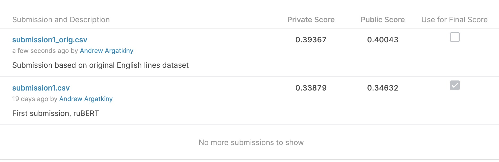

# Kaggle Inclass Friends Dialogues Classification Challenge

I won 1st place in this competition. The task was to learn to classify which character of "Friends" TV series a line of dialogue belongs to given scripts automatically translated to Russian.

What I liked about it is that it's not your usual NLP classification task like discerning positive/negative reviews or toxic comments. All of that is easily done by us, humans. 

But it's no way an easy feat (at least, for me) to distinguish between different persons given only texts of their lines.

## The task

You can learn more about the competition at:

https://www.kaggle.com/c/friends-classification/leaderboard

## Best Solution

I fine-tuned RuBERT model pretrained on Russian language by @sberbank-ai researchers with some tweaking.

Final solution (and, coincidentally, baseline):

[FinalSolution.ipynb](FinalSolution.ipynb)

## Other approaches 

There also were many interesting approaches and hypotheses tested which, however, wouldn't surpass my winning baseline.

Somewhat surprisingly, none of many NLP augmentations, back and back-back translations with SOTA seq2seq models, tweaks in architectures, and hyperparameters, use of different pretrained BERT-like transformer models both in Russian and English yielded noticeably higher accuracy.

I guess that happens because of detrimental effect of distortions in machine translations and albumentations which do more harm than good in highly style-sensitive NLP objective.

Anyway, all these things are certanly worth mentioning, so I made some of  them available 'as is' at `hypotheses` subdirectory.

All approaches are described in the slides:

[Friends Classification.pdf](Friends%20Classification.pdf)

Also, you can watch my talk about the solution (in Russian):

https://youtu.be/dZvuZCvQOxM?t=4261

# Aftermath

After the competition had concluded, I was eager to find out, to which extent information gets lost due to often distorted and incomprehensive machine translitions.

The organizers kindly pointed me to their repo with original and translated scripts: 
https://github.com/Alenush/style_transfer_sirius2021summer/

And I managed to recreate the dataset with original characters' dialogues in English.

As I've anticipated, the resulting accuracy improved from 33,9% to 39,4% on test set! 

The code for the model and data preprocessing is available at `eng_original_model` subdirectory.